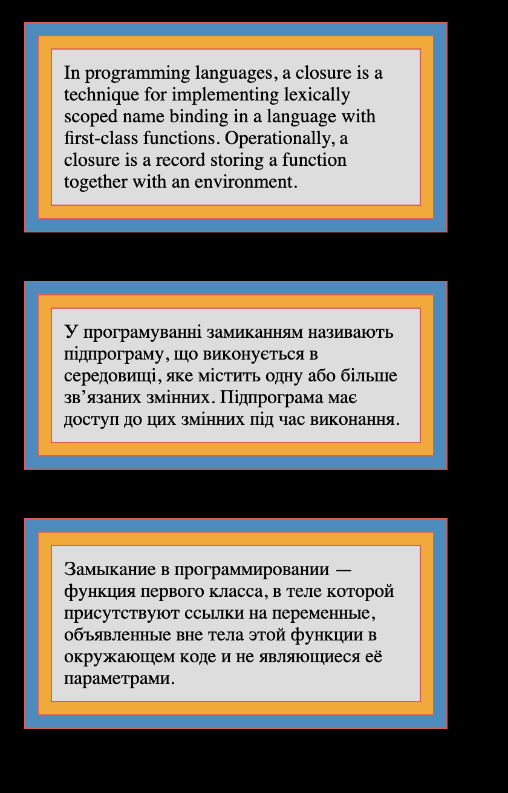

Зробити по макету:

**Вимоги до виконання:**

1. Створити блок який буде будь-який background на ваш вибір, та border з 3px ширини, задавати для цього блоку треба тільки ширину, без висоти
2. Всередині має бути ще один блок, без вказаної ширини, та висоти, так само з background і з border 2px ширини
3. Створити всередині ще один блок, в якому буде будь-який текст, з background теж та border 1px
4. Повинні бути ще 2 таких блоки, які будуть мати відступи між собою
5. Відступи всередині блоку робити за допомогою margin padding
